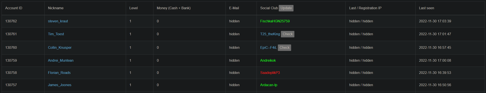

# GrandRP ACP - Rockstar Social Club Improvements (GRSI)
<p align="center"></p>

## Features

### ACP
* SocialClubs link to the member search on the Rockstar SocialClub Website (Authorization Logs as well as Player Search)
* Color-Highlight valid/invalid SC Accounts (Authorization Logs as well as Player Search)

### SocialClub Website
* Buttons to manually store if Account is valid or not
* Option: Color Highlight exact matches
* Option: Show SocialClub ID for match or all accounts from a search

### Common
* Local storage system using Tampermokeys ```GM_getValue``` and ```GM_setValue``` features
* Automatically Process SocialClubs
	* Automatically detect and store searchresults done on the Rockstar members list
	* Option: Close SocialClub website after processing
	* Option: Button to process SC in a sepreate window that closes after processing
	* Option: Button on previously processed SocialClubs


## Installation

```Fusion.js``` is a [Tampermonkey](https://www.tampermonkey.net/) Skript, currently used and tested with version 4.18.1 on Chrome, although it should work with all other Tampermonkey-supported Browsers as well.

To install it, create a new userscript inside Tampermokey, paste the contents of ```Fusion.js```, and enable the script.

## Usage

### General
* Find your Account in question  
  
* Search SocialClub either by clicking the SocialClub in the ACP or manually through Rockstars Website  
  
* Optionally: Color Highlight the exact match and/or show it's SCID.  
  
* Determine if the account exists, and save that value by pressing the "Yes" or "No" buttons. "Clear" will unset the previous values for the searched Account.  
  
* Return to the ACP page and either search again or press the "Update" button in the Social Club field to see the color highlighting  


### Autoprocess

**Disclaimer:** Autoprocess is in a Beta state. Invalid (red) SocialClubs should always be manually confirmed to be invalid. Valid Accounts (Green) are 100% guaranteed to exist, although they may be spoofed (check the SCID).

#### Autoprocess through Search
* Find your Account in question  
  
* Search SocialClub either by clicking the SocialClub in the ACP or manually through Rockstars Website  
  
* The script will now automatically save the search result, there's no further interaction needed with the Rockstar page.  
* Return to the ACP page and either search again or press the "Update" button in the Social Club field to see the color highlighting  
  

#### Autoprocess in Background
* Find your Account in question  
  
* A new window will open, loading the SocialClub website. The Window will close after the value is stored. No further interaction is needed.  
  
* Return to the ACP page and either search again or press the "Update" button in the Social Club field to see the color highlighting  
